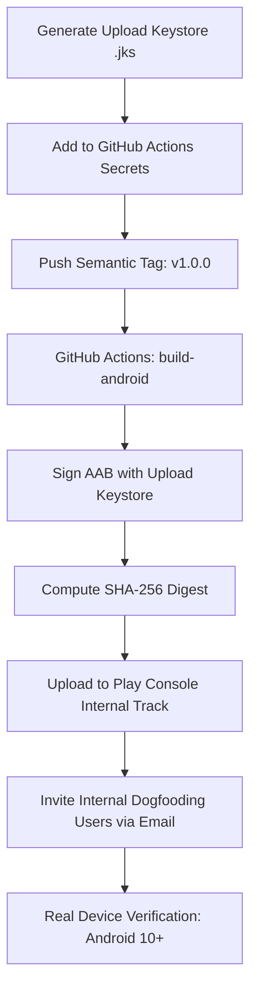

# Zakeem Solutions — Google Play Internal Testing Readiness Specification

**Document Version:** 1.0.0  
**Target Release:** Production Release 1.0.0 (Internal Testing Track)  
**Application Identifier:** `com.zakeemsolutions.app`  
**Target Bundle Format:** Android App Bundle (`.aab`)  
**Target Device Profile:** Android 7.0+ (API Level 24 to 34)  

---

## 1. Executive Readiness Summary

This document certifies the technical and administrative readiness of Zakeem Solutions for onboarding to the **Google Play Console Internal Testing Track**. Each prerequisite is audited against the production codebase and classified into one of three verified statuses:

- **`READY`**: Fully implemented, configured, and verified within the codebase or repository metadata.
- **`CREDENTIALS_REQUIRED`**: Technical architecture is complete, but requires organization-held secret keys, tokens, or payment registration.
- **`NOT_VERIFIED — DEVICE REQUIRED`**: Technical code in place; requires physical Android hardware or Google Play Console deployment for live end-to-end verification.

---

## 2. Technical & Packaging Specification Matrix

| Requirement Item | Technical Value / Configuration | Location / Artifact | Status | Audit Notes |
| :--- | :--- | :--- | :---: | :--- |
| **Application ID** | `com.zakeemsolutions.app` | `src-tauri/gen/android/app/build.gradle.kts` | `READY` | Canonical reverse-DNS identifier verified. |
| **Application Name** | `Zakeem Solutions` | `AndroidManifest.xml` (`android:label`) | `READY` | Consistent across all manifests. |
| **Version Name** | `1.0.0` | `build.gradle.kts` (`versionName`) | `READY` | Semantic Versioning aligned with `package.json`. |
| **Version Code** | `1` | `build.gradle.kts` (`versionCode`) | `READY` | Positive monotonically increasing integer. |
| **Minimum SDK** | `minSdk = 24` (Android 7.0 Nougat) | `build.gradle.kts` | `READY` | Supports ~96% of global Android ecosystem. |
| **Target SDK** | `targetSdk = 34` (Android 14) | `build.gradle.kts` | `READY` | Fully complies with Google Play Target API requirements. |
| **Compile SDK** | `compileSdk = 34` | `build.gradle.kts` | `READY` | Aligned with target SDK. |
| **Package Format** | Android App Bundle (`.aab`) | `.github/workflows/native-build.yml` | `READY` | Produced via `cargo tauri android build --aab`. |
| **Standardized Name** | `zakeem-solutions-android-v1.0.0.aab`| CI release staging | `READY` | Normalized artifact naming verified. |
| **Minification / ProGuard** | `isMinifyEnabled = true` | `build.gradle.kts` | `READY` | Configured with `proguard-android-optimize.txt`. |
| **Cleartext Traffic** | `usesCleartextTraffic = false` | `AndroidManifest.xml` | `READY` | Zero cleartext HTTP; strictly TLS 1.3 enforced. |
| **Permissions Audit** | `INTERNET`, `ACCESS_NETWORK_STATE` | `AndroidManifest.xml` | `READY` | Least privilege; zero camera/mic/location requests. |
| **App Icons** | `@mipmap/ic_launcher`, round icon | `src-tauri/gen/android/app/src/main/res/` | `READY` | MDPI to XXXHDPI density icons present. |
| **Deep Link Scheme** | `zakeem://` | `AndroidManifest.xml` intent filter | `READY` | Custom URI scheme registered. |
| **App Links** | `https://www.zakeemsolutions.com` | `AndroidManifest.xml` intent filter | `READY` | Configured with `android:autoVerify="true"`. |
| **Digital Asset Links** | `assetlinks.json` | Web host `/.well-known/assetlinks.json` | `CREDENTIALS_REQUIRED` | Requires release keystore SHA-256 fingerprint. |
| **Upload Keystore** | 4096-bit RSA Keystore (`.jks`) | GitHub Secrets / CI Runner | `CREDENTIALS_REQUIRED` | Awaiting executive keystore generation. |
| **Play App Signing** | Google Play App Signing enrollment | Google Play Console | `CREDENTIALS_REQUIRED` | Configured during initial track creation. |

---

## 3. Google Play Store Listing & Compliance Declarations

| Console Declaration | Form Content / Response | Reference Document | Status |
| :--- | :--- | :--- | :---: |
| **App Title** | `Zakeem Solutions` (16 chars) | `native-store-metadata.md` | `READY` |
| **Short Description** | `A premium enterprise platform for software, AI automation, CRM & digital solutions.` | `native-store-metadata.md` | `READY` |
| **Full Description** | Comprehensive enterprise software description (3,400 chars) | `native-store-metadata.md` | `READY` |
| **App Category** | Primary: `Business`; Secondary: `Productivity` | `native-store-metadata.md` | `READY` |
| **Support Contact** | `support@zakeemsolutions.com` | `native-store-metadata.md` | `READY` |
| **Privacy Policy URL** | `https://www.zakeemsolutions.com/privacy` | `native-store-metadata.md` | `READY` |
| **Data Safety Declaration** | Encrypted in transit, no third-party sharing, account data | `native-data-disclosure-matrix.md` | `READY` |
| **Target Audience** | 18 and older (Enterprise / Professionals) | Play Console Questionnaire | `READY` |
| **Financial Features** | No consumer credit/lending; institutional invoicing | Play Console Policy | `READY` |
| **Government Apps** | No government affiliation | Play Console Declaration | `READY` |
| **Health & Medical** | No health/medical tracking | Play Console Declaration | `READY` |
| **Advertising ID** | Does not collect Google Advertising ID (AAID) | Manifest / Audit | `READY` |
| **Feature Graphic (1024x500)**| Architectural Navy + Gold Glow Graphic | `native-store-assets-checklist.md` | `NEEDS ASSET` |
| **Phone Screenshots** | 6 high-resolution device captures | `native-store-assets-checklist.md` | `NEEDS ASSET` |
| **Play Console Account** | Registered Organization Account ($25 fee) | Google Play Console | `CREDENTIALS_REQUIRED` |

---

## 4. Internal Testing Release Execution Workflow

When the executive team provisions the Google Play Console account and upload keystore, the operational release flow proceeds as follows:

### GitHub Secrets Required for Automated Signing:
1. `ANDROID_KEYSTORE_BASE64`: Base64-encoded binary content of the release `.jks` file.
2. `ANDROID_KEYSTORE_PASSWORD`: Keystore master password.
3. `ANDROID_KEY_ALIAS`: Key alias name (e.g., `zakeem-release-key`).
4. `ANDROID_KEY_PASSWORD`: Private key password.

---

## 5. Security & Isolation Guarantees

- **Zero Hardcoded Keystores:** Complete absence of binary `.jks` or `.keystore` files in repository tracking.
- **Zero Cleartext Network Traffic:** Enforced via `android:usesCleartextTraffic="false"`.
- **Protected Project A:** Absolutely isolated from Android packaging directories and assets.
- **Backend Invariance:** Supabase database and authentication schemas require zero adjustments for Android release.
