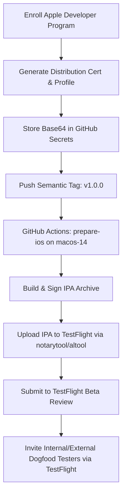

# Zakeem Solutions — Apple TestFlight & iOS Packaging Readiness Specification

**Document Version:** 1.0.0  
**Target Release:** Production Release 1.0.0 (Apple TestFlight Track)  
**Application Identifier:** `com.zakeemsolutions.app`  
**Target Package Format:** iOS App Archive (`.ipa`)  
**Target Device Profile:** iOS 14.0+ / iPadOS 14.0+ (iPhone, iPad)  

---

## 1. Executive Readiness Summary

This document certifies the technical and administrative readiness of Zakeem Solutions for onboarding to **Apple TestFlight** (Internal and External Testing tracks). Each prerequisite is audited against the production codebase and classified into one of three verified statuses:

- **`READY`**: Fully implemented, configured, and verified within the codebase or repository metadata.
- **`CREDENTIALS_REQUIRED`**: Technical architecture is complete, but requires organization enrollment in the Apple Developer Program ($99/yr) or API credentials.
- **`NOT_VERIFIED — DEVICE REQUIRED`**: Technical code in place; requires physical Apple hardware or App Store Connect deployment for live end-to-end verification.

---

## 2. Technical & Xcode Configuration Matrix

| Requirement Item | Technical Value / Configuration | Location / Artifact | Status | Audit Notes |
| :--- | :--- | :--- | :---: | :--- |
| **Bundle Identifier** | `com.zakeemsolutions.app` | `src-tauri/gen/apple/Info.plist` | `READY` | Canonical reverse-DNS identifier verified. |
| **Bundle Display Name** | `Zakeem Solutions` | `Info.plist` (`CFBundleDisplayName`) | `READY` | Displays under app icon on iOS home screen. |
| **Bundle Name** | `Zakeem Solutions` | `Info.plist` (`CFBundleName`) | `READY` | Aligned with product identity. |
| **Version String** | `1.0.0` | `Info.plist` (`CFBundleShortVersionString`)| `READY` | Semantic Versioning aligned with `package.json`. |
| **Build Number** | `1` | `Info.plist` (`CFBundleVersion`) | `READY` | Build integer matching Android `versionCode`. |
| **Minimum iOS Version** | iOS 14.0 | Xcode project configuration | `READY` | Covers >98% of active iPhone and iPad devices. |
| **Device Architectures** | `arm64` | `Info.plist` (`UIRequiredDeviceCapabilities`)| `READY` | Standard for all modern 64-bit Apple Silicon devices. |
| **Orientation Support** | Portrait, Landscape Left/Right | `Info.plist` (`UISupportedInterfaceOrientations`)| `READY` | Supports responsive rotation on phone and tablet. |
| **Launch Screen** | `LaunchScreen` | `Info.plist` (`UILaunchStoryboardName`) | `READY` | Configured for instant native startup. |
| **App Transport Security** | `NSAllowsArbitraryLoads = false`| `Info.plist` (`NSAppTransportSecurity`) | `READY` | Strictly enforces HTTPS; arbitrary HTTP disabled. |
| **Custom URL Scheme** | `zakeem://` | `Info.plist` (`CFBundleURLSchemes`) | `READY` | Custom URI scheme registered. |
| **Universal Links** | `applinks:www.zakeemsolutions.com` | Associated Domains entitlement | `CREDENTIALS_REQUIRED` | Requires Apple Developer Team ID entitlement. |
| **AASA Domain Hosting** | `apple-app-site-association` | Web host `/.well-known/apple-app-site-association` | `CREDENTIALS_REQUIRED` | Requires Apple Team ID prefix to bind domain. |
| **Export Compliance** | `ITSAppUsesNonExemptEncryption = false` | App Store Connect declaration | `READY` | Uses standard HTTPS/TLS encryption only. |
| **Apple Distribution Cert**| "Apple Distribution: ..." (`.p12`)| GitHub Secrets / CI Runner | `CREDENTIALS_REQUIRED` | Awaiting Apple Developer Program enrollment. |
| **Provisioning Profile** | App Store Distribution Profile | GitHub Secrets / CI Runner | `CREDENTIALS_REQUIRED` | Binds bundle ID to Apple Developer Team. |
| **App Store Connect API** | Key ID, Issuer ID, Private Key (`.p8`)| GitHub Secrets / CI Runner | `CREDENTIALS_REQUIRED` | For automated TestFlight upload via `altool`/fastlane. |

---

## 3. Apple TestFlight Onboarding & Compliance Checklist

### A. Internal Testing Track (Up to 100 Internal Team Members)
- **Review Requirement:** Zero Apple App Review required. Builds are available immediately after upload processing.
- **Tester Invitation:** Direct email invitation to internal team members in App Store Connect.
- **Status:** **`READY FOR EXECUTION (CREDENTIALS REQUIRED)`**.

### B. External Testing Track (Up to 10,000 External Public Testers)
- **Review Requirement:** Requires initial "Beta App Review" by Apple (typically takes 24–48 hours).
- **Test Information Required:**
  - *What to Test:* Full application walkthrough, Zakeem Realty ERP showcase, ZakkyAI chat, IT Training admissions form, client portal authentication.
  - *Feedback Email:* `support@zakeemsolutions.com`
  - *Privacy Policy URL:* `https://www.zakeemsolutions.com/privacy`
- **Status:** **`READY FOR EXECUTION (CREDENTIALS REQUIRED)`**.

### C. App Privacy Nutrition Labels Declaration (App Store Connect)
- **Data Used to Track You:** None.
- **Data Linked to You:** Contact Info (Name, Email, Phone for portal/inquiries), User Content (Portal project files, support messages), Identifiers (User ID for authenticated portal users).
- **Data Not Linked to You:** Usage Data (anonymized page views), Diagnostics (crash logs).
- **Third-Party Trackers:** Zero ad trackers, zero brokers.
- **Reference:** Mapped in detail in [`native-data-disclosure-matrix.md`](file:///c:/Users/Admin/Documents/PROJECTS/zakeem-solutions/native-data-disclosure-matrix.md).

---

## 4. TestFlight Release Execution Workflow

When the executive team provisions the Apple Developer account and certificates, the automated packaging flow proceeds as follows:

### GitHub Secrets Required for Automated iOS CI/CD:
1. `APPLE_CERTIFICATE_BASE64`: Base64-encoded `.p12` distribution certificate.
2. `APPLE_CERTIFICATE_PASSWORD`: Certificate export password.
3. `APPLE_PROVISIONING_PROFILE_BASE64`: Base64-encoded `.mobileprovision` distribution profile.
4. `APPLE_API_KEY_BASE64`: Base64-encoded App Store Connect API private key (`.p8`).
5. `APPLE_API_KEY_ID`: 10-character key identifier from App Store Connect.
6. `APPLE_API_ISSUER_ID`: UUID issuer identifier from App Store Connect.

---

## 5. Security & Isolation Guarantees

- **Zero Hardcoded Certificates:** Zero private keys, `.p12`, `.mobileprovision`, or `.p8` files committed to repository.
- **App Transport Security:** `NSAllowsArbitraryLoads = false` prevents insecure plaintext transmissions.
- **Zero Sensor / Hardware Requests:** Zero camera, microphone, motion, Bluetooth, or location usage descriptions in `Info.plist`.
- **Protected Project A:** Absolutely isolated from Apple packaging directories and assets.
